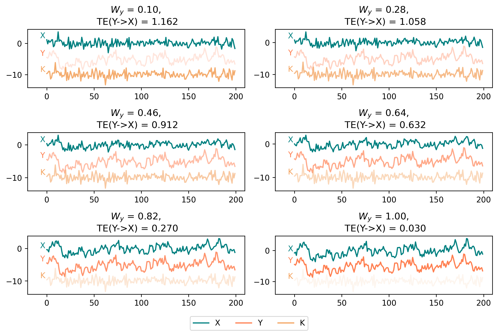
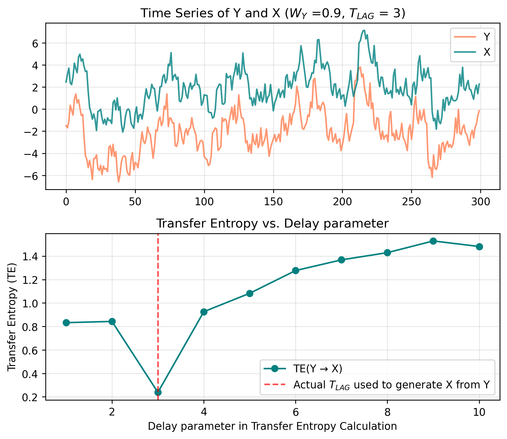

# Transfer Entropy (TE)

Implementation in python3 of transfer entropy statistic between two time series. Refer to the function `transfer_entropy(X, Y, delay)` present in `TE.py`.
Transfer entropy from Y to X, where X,Y are two random processes, is an asymmetric statistic measuring the reduction in uncertainty for a future value of X given the history of X and Y. Or the amount of information from Y to X. Calculated through the Kullback-Leibler divergence with conditional probabilities.

## Transfer Entropy Example:

Transfer entropy (TE) between an auto-correlated time series Y and a derived time series X, assessing how different weight contributions from Y affect the value of the TE. The code used to generate the following plots is present in `test_TE.ipynb`.

### Generation of timeseries

- Y is generated as an auto-correlated time series using an AR(1) process, meaning each value depends on the previous one with some added noise and an AR coefficient `ar_coefficient`.  
- K is generated as an independent noise series with no auto-correlation.

- X is then computed as a lagged and noisy linear combination of Y and K:

    - $ X[t] = W_Y \cdot Y[t-T_{LAG}] + (1- W_Y) \cdot K[t-T_{LAG}] $
    - The $T_{LAG}$ determines the time lag with which X is generated as a shifted version of Y and K.
    - The weight parameter $W_{Y}$ determines how much Y contributes to X.

### TE(Y → X) under different information transfer scenarios ($W_{Y}$)

- The following analysis shows six different cases where $W_{Y}$ increases from 0.1 to 1.   
- As $W_Y$ increases (the amount of information from Y to X), the transfer entropy TE(Y → X) decreases, indicating a higher capability of predicting future values of X.
- Higher $W_Y$ (stronger influence of Y on X) corresponds to higher opacity in the plot. 
- The 'delay' parameter is set here as 'delay = $T_{LAG}$ = 3' to instead focus on the effect of different $W_{Y}$ values

### TE(Y → X) vs Delay parameter in transfer entropy estimation

- Transfer entropy is the lowest when the `delay` used to evaluate the TE between X and Y coincides to the $T_{LAG}$ used to generate X as a shifted version of Y, as expected.
- Here X is a rolled version of Y with a delay of 3, the choice of delay in evaluating TE is crucial. TE statistic can therefore also be used to uncover at which time lag Y influences X(delay at which TE is the lowest).
- Here we are also using Y as an autocorrelated timeseries, therefore also at `delay $\approx T_{LAG}$` we still observe a low TE values.

